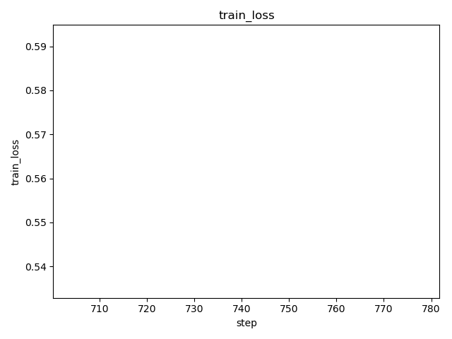
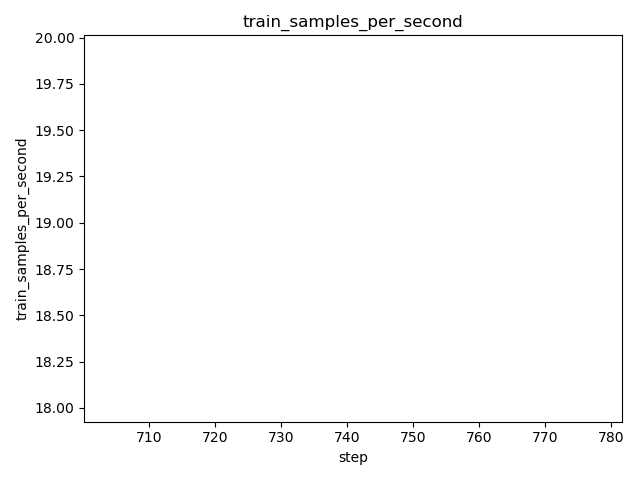
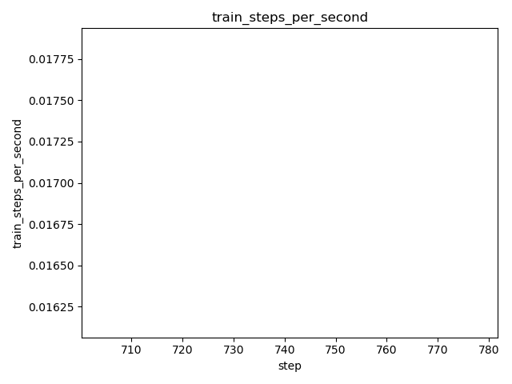
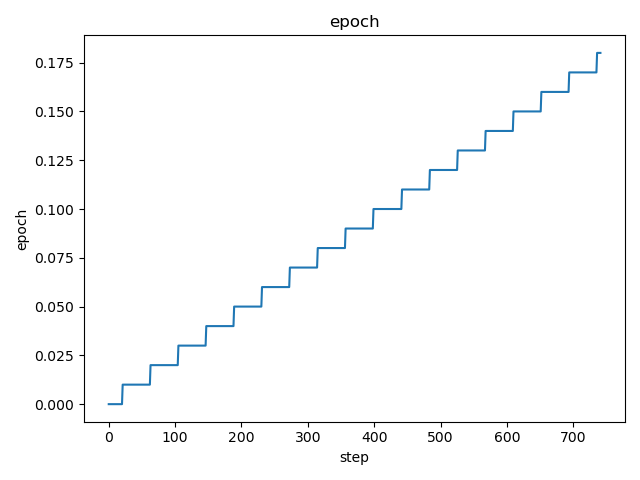
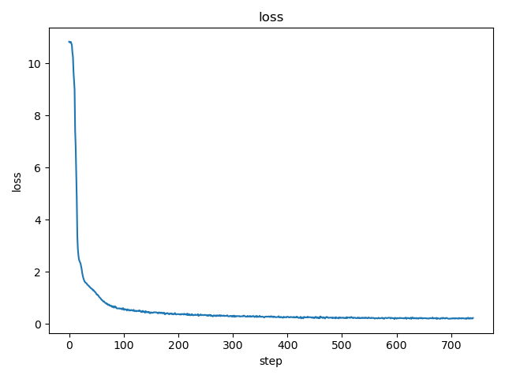
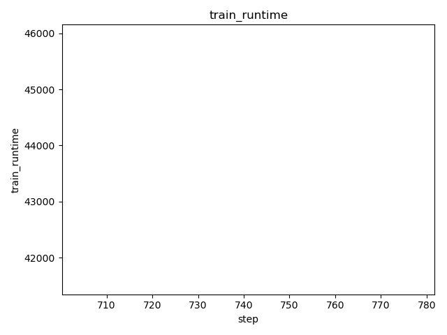
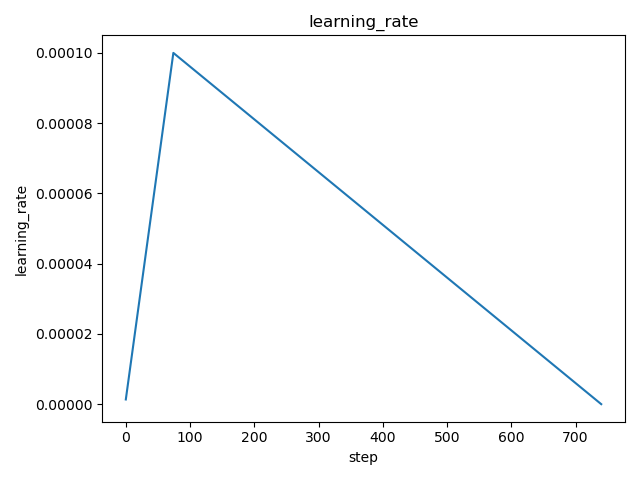

# DVC Report

metrics.json

|   loss |   learning_rate |   epoch |   step |   train_runtime |   train_samples_per_second |   train_steps_per_second |   train_loss |
|--------|-----------------|---------|--------|-----------------|----------------------------|--------------------------|--------------|
| 0.2204 |               0 |    0.18 |    741 |         43750.4 |                     18.969 |                    0.017 |     0.563858 |

