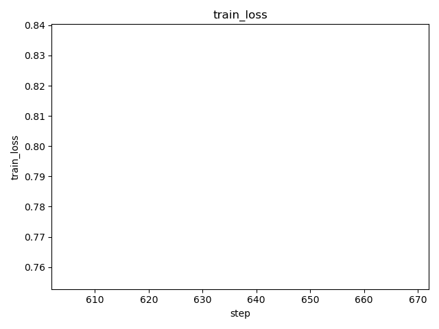
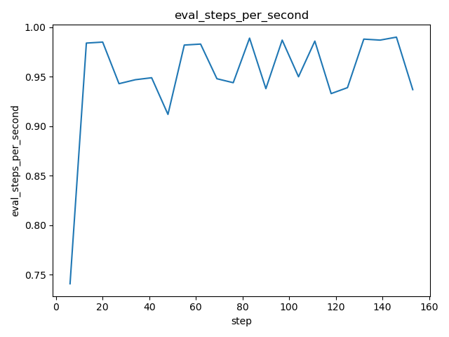
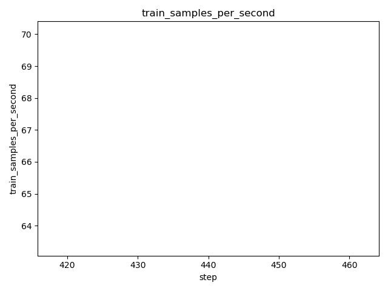
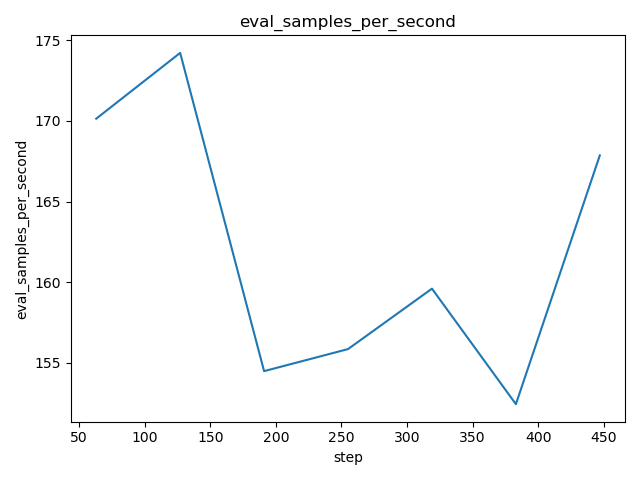
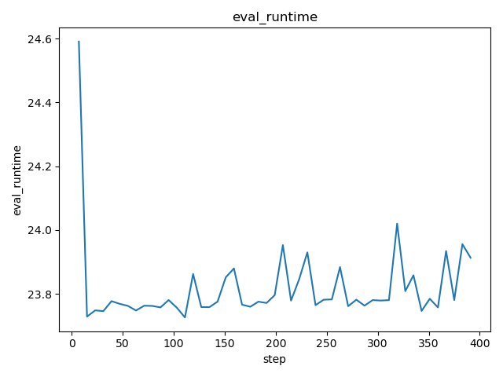
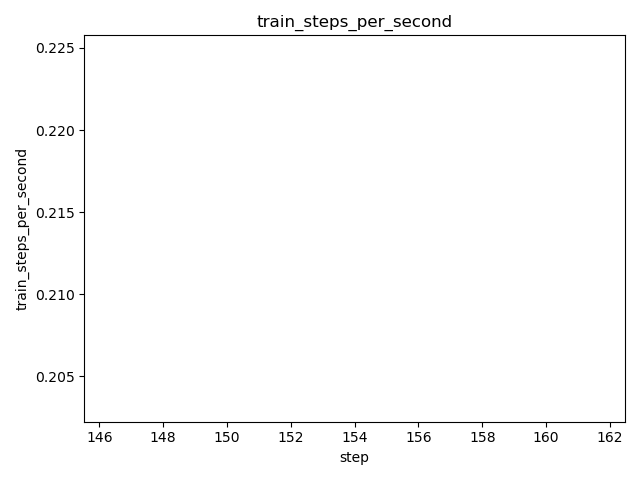
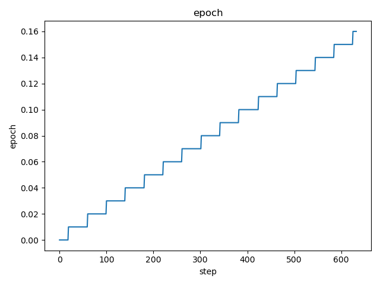
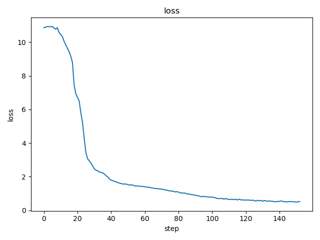
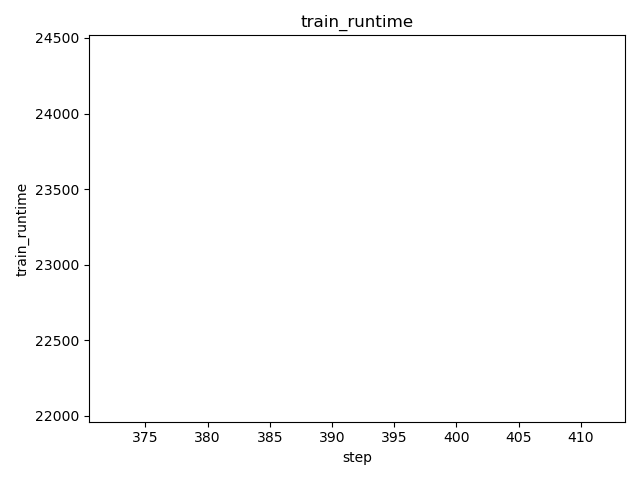
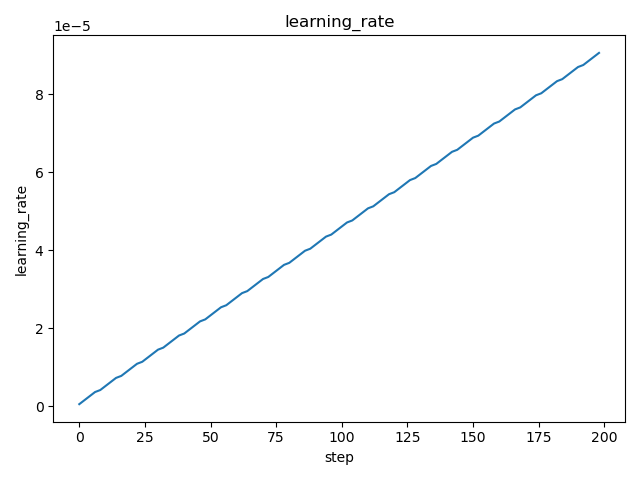

# DVC Report

metrics.json

|   loss |   learning_rate |   epoch |   step |   eval_loss |   eval_runtime |   eval_samples_per_second |   eval_steps_per_second |   train_runtime |   train_samples_per_second |   train_steps_per_second |   train_loss |
|--------|-----------------|---------|--------|-------------|----------------|---------------------------|-------------------------|-----------------|----------------------------|--------------------------|--------------|
| 0.2182 |     8.70625e-05 |    0.11 |    440 |     1.54361 |        30.5584 |                    70.979 |                   0.524 |         29835.6 |                      66.73 |                     0.06 |      1.07668 |

