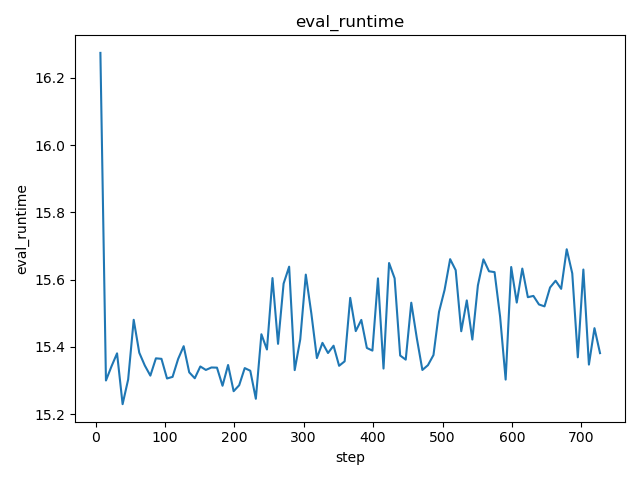
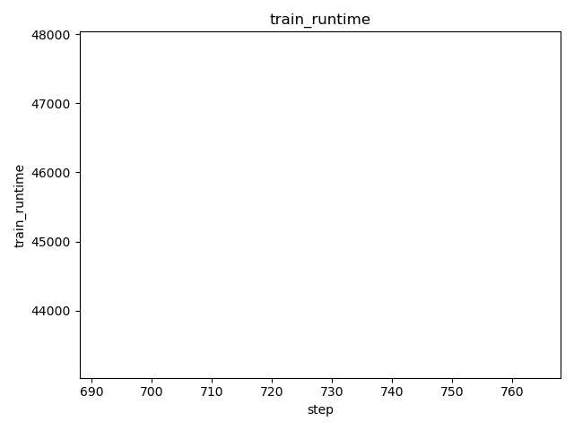

# DVC Report

metrics.json

|   loss |   learning_rate |   epoch |   step |   eval_loss |   eval_runtime |   eval_samples_per_second |   eval_steps_per_second |   train_runtime |   train_samples_per_second |   train_steps_per_second |   train_loss |
|--------|-----------------|---------|--------|-------------|----------------|---------------------------|-------------------------|-----------------|----------------------------|--------------------------|--------------|
|  0.247 |     9.15429e-05 |    0.09 |    392 |     1.56502 |         23.913 |                    74.562 |                   0.544 |         23212.7 |                     93.858 |                    0.084 |      1.21745 |

