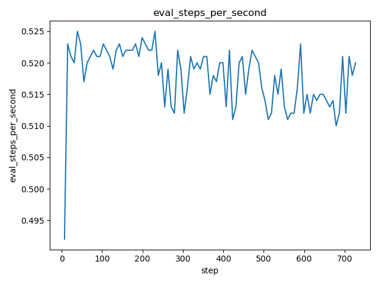
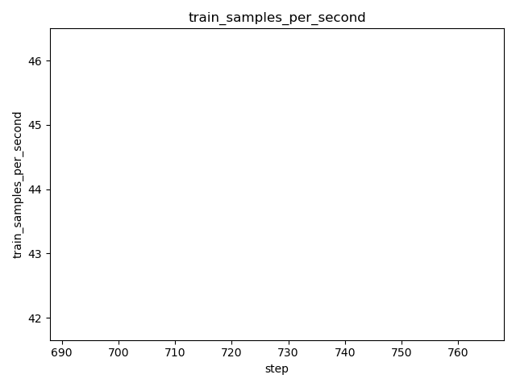

# DVC Report

metrics.json

|   loss |   learning_rate |   epoch |   step |   eval_loss |   eval_runtime |   eval_samples_per_second |   eval_steps_per_second |   train_runtime |   train_samples_per_second |   train_steps_per_second |   train_loss |
|--------|-----------------|---------|--------|-------------|----------------|---------------------------|-------------------------|-----------------|----------------------------|--------------------------|--------------|
| 0.2761 |     9.13395e-05 |    0.09 |    392 |     1.73122 |         9.5213 |                    59.131 |                   0.525 |         23239.2 |                     92.773 |                    0.083 |       1.1652 |

