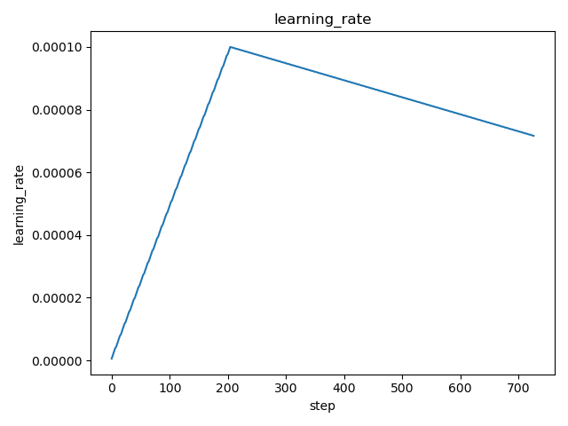

# DVC Report

metrics.json

|   loss |   learning_rate |   epoch |   step |   eval_loss |   eval_runtime |   eval_samples_per_second |   eval_steps_per_second |   train_runtime |   train_samples_per_second |   train_steps_per_second |   train_loss |
|--------|-----------------|---------|--------|-------------|----------------|---------------------------|-------------------------|-----------------|----------------------------|--------------------------|--------------|
| 0.0961 |     8.51852e-05 |     0.7 |    448 |   0.0765347 |        59.5721 |                   167.864 |                   0.185 |         21766.1 |                     170.26 |                    0.087 |     0.804925 |

