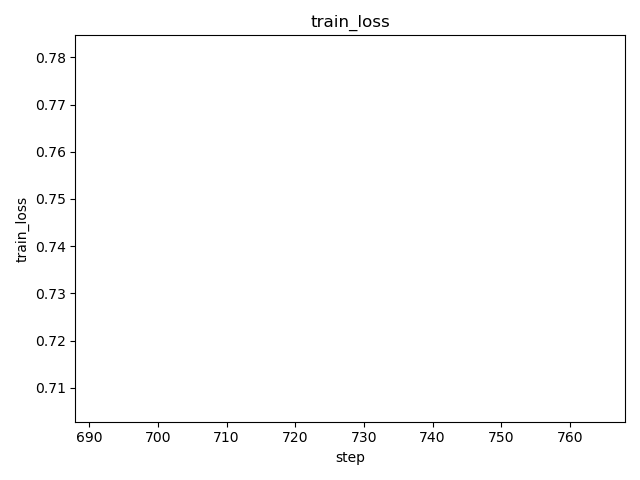

# DVC Report

metrics.json

|   loss |   learning_rate |   epoch |   step |   eval_loss |   eval_runtime |   eval_samples_per_second |   eval_steps_per_second |   train_runtime |   train_samples_per_second |   train_steps_per_second |   train_loss |
|--------|-----------------|---------|--------|-------------|----------------|---------------------------|-------------------------|-----------------|----------------------------|--------------------------|--------------|
| 0.1885 |      7.2083e-05 |    0.18 |    637 |     1.24537 |        16.7594 |                   144.993 |                   0.955 |         31572.8 |                     55.086 |                    0.049 |     0.796541 |

