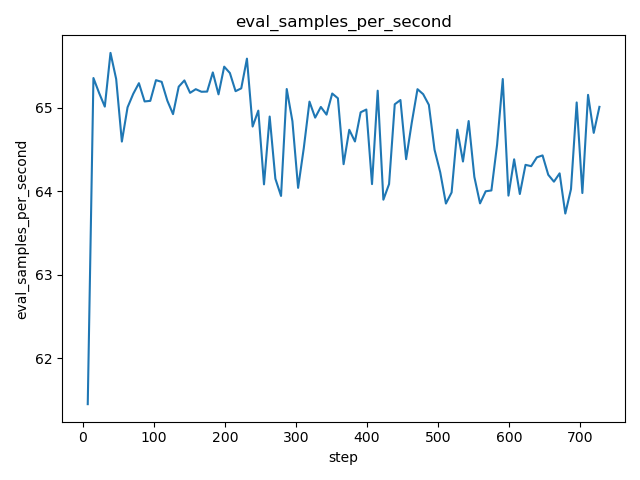

# DVC Report

metrics.json

|   loss |   learning_rate |   epoch |   step |   eval_loss |   eval_runtime |   eval_samples_per_second |   eval_steps_per_second |   train_runtime |   train_samples_per_second |   train_steps_per_second |   train_loss |
|--------|-----------------|---------|--------|-------------|----------------|---------------------------|-------------------------|-----------------|----------------------------|--------------------------|--------------|
| 0.5231 |     7.58621e-05 |    0.04 |    154 |     1.81079 |         4.2668 |                   132.886 |                   0.937 |         8122.74 |                    239.234 |                    0.214 |      2.45657 |

