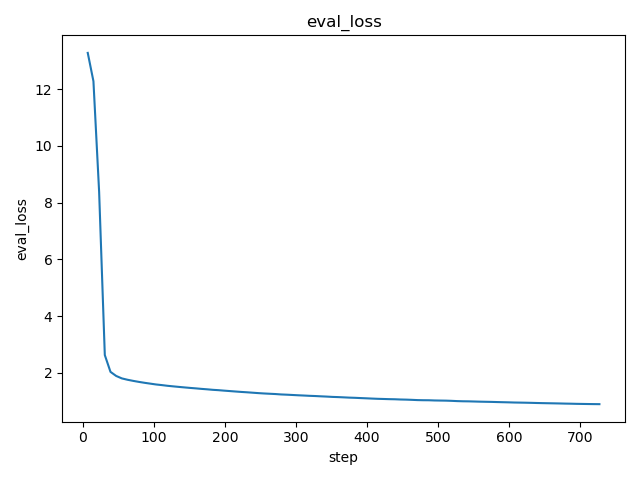
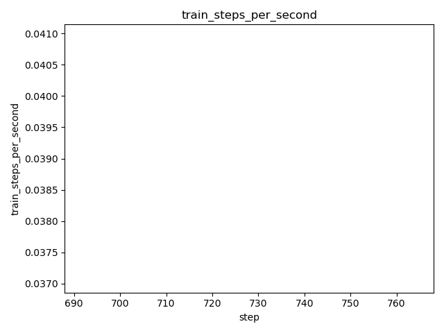

# DVC Report

metrics.json

|   loss |   learning_rate |   epoch |   step |   eval_loss |   eval_runtime |   eval_samples_per_second |   eval_steps_per_second |   train_runtime |   train_samples_per_second |   train_steps_per_second |   train_loss |
|--------|-----------------|---------|--------|-------------|----------------|---------------------------|-------------------------|-----------------|----------------------------|--------------------------|--------------|
| 1.1623 |     9.06736e-05 |    0.05 |    200 |     1.80825 |         8.5522 |                    65.831 |                   0.935 |         19310.1 |                     111.65 |                      0.1 |       2.5911 |

