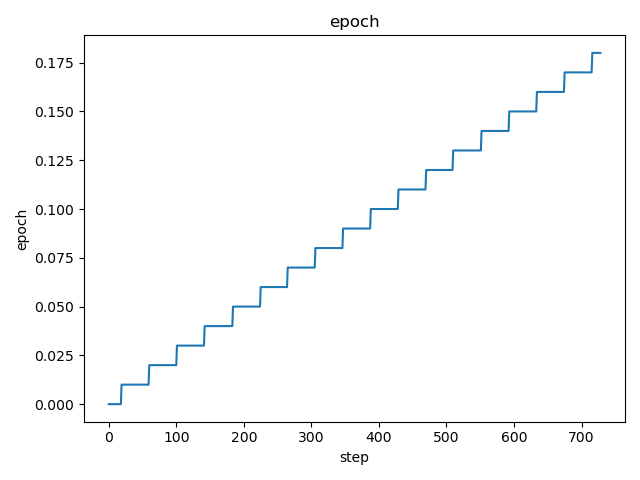
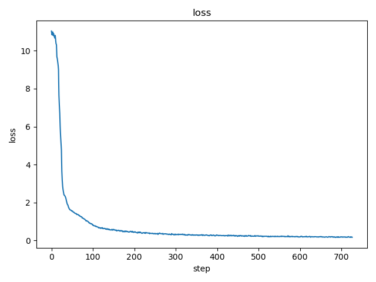

# DVC Report

metrics.json

|   loss |   learning_rate |   epoch |   step |   eval_loss |   eval_runtime |   eval_samples_per_second |   eval_steps_per_second |   train_runtime |   train_samples_per_second |   train_steps_per_second |   train_loss |
|--------|-----------------|---------|--------|-------------|----------------|---------------------------|-------------------------|-----------------|----------------------------|--------------------------|--------------|
| 0.4314 |     9.65517e-05 |    0.05 |    196 |       1.773 |         8.3387 |                    67.996 |                   0.959 |         18661.8 |                    104.129 |                    0.093 |      1.97315 |

